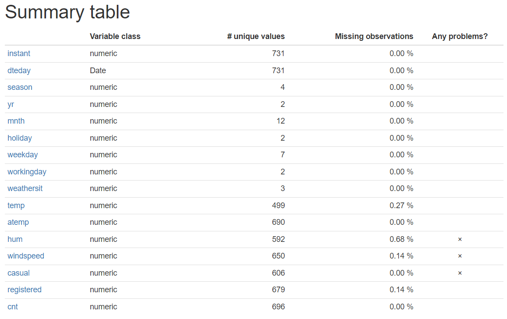
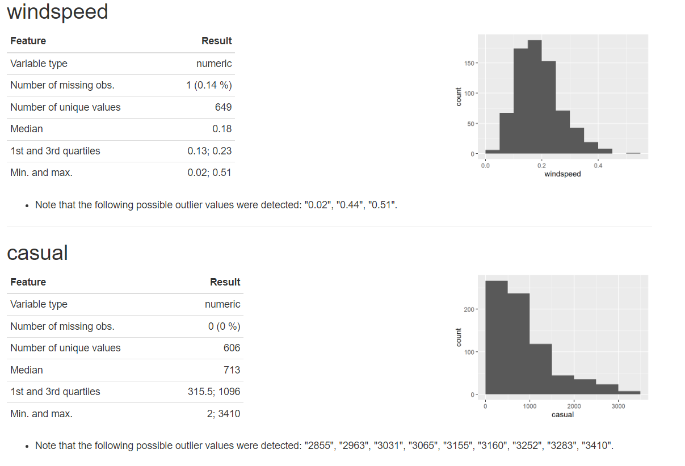

```{r setup, include=FALSE}
knitr::opts_chunk$set(echo = TRUE)
if(!require(tidyverse)) install.packages("tidyverse")
library(tidyverse)

if(!require(dataMaid)) install.packages("dataMaid")
library(dataMaid)

if(!require(skimr)) install.packages("skimr")
library(skimr)

if(!require(outliers)) install.packages("outliers")
library(outliers)

if(!require(rstatix)) install.packages("rstatix")
library(rstatix)

if(!require(EnvStats)) install.packages("EnvStats")
library(EnvStats)

if(!require(MVN)) install.packages("MVN")
library(MVN)
```

# Автоматический подход к поиску неточностей

В любой работе с данными с ростом объемов информации, особенно в больших наборах данных, становится все сложнее находить выбросы и ошибки, которые могут исказить результаты анализа. Исследователи в первую очередь полагаются на визуальный осмотр данных, что удобно для небольших датасетов, однако плохо масштабируется с увеличением количества колонок и наблюдений.

С увеличением объема данных и их сложности стало очевидно, что нужны автоматизированные инструменты. В этом проекте мы рассматриваем наборы инструментов для автоматического поиска выбросов и ошибок в датасетах. Эти инструменты помогут ускорить анализ и сделать его более точным, позволяя исследователям сосредоточиться на более интересных задачах, сделав рутинное ковыряние в данных более эффективным и менее времязатратным.

В качестве примера данных загрузим датасет из проекта 1 (убедитесь, что загрузили эти данные в папку с этим Rmd файлом).

```{r dir}
# main_dir <- dirname(rstudioapi::getSourceEditorContext()$path) 
# setwd(main_dir)
day_df <- read_csv("day.csv")
head(day_df)
```

**Рассматриваемые подходы и пакеты:**

1.  **`dataMaid`**: Помогает автоматизировать проверку качества данных. Он может находить пропуски, ошибки в типах данных, выбросы, а также автоматически создавать отчёты по результатам анализа.
2.  **`skimr`**: Пакет для быстрого суммарного обзора данных, включая пропущенные значения, распределение переменных и типы данных.
3.  **`outliers`**: содержит тесты для оценки достоверности наличия выбросов.
4.  **`EnvStats`**: позволяет определить и оценить потенциальные выбросы.
5.  **`rstatix`**: позволяет искать многомерные выбросы на основе расстояния Махаланобиса и скорректированного расстояния Махаланобиса.

-   **`boxplot`**: встроенная функция, позволяющая строить графики и визуально оценивать наличие выбросов.

## 1. dataMaid

[**dataMaid**](https://cran.r-project.org/web/packages/dataMaid/dataMaid.pdf) простой пакет, который в 1 клик создаёт rmd-отчёт по вашему датафрейму и конвертирует его в pdf, docx, html.

Большим плюсом является кастомизируемость пакета, в него можно добавить свои функции для автоматического использования, что подробно описано в документации:

> The customizability features of `dataMaid` essentially comes down to writing such `summaryFunctions`, `visualFunctions` and `checkFunctions`.

```{r datareport}
makeDataReport(day_df)
# генерируем отчет в html
makeDataReport(day_df, output = "html", replace = TRUE)
# подробно о функции
?makeDataReport()

```

### Примеры работы:





Этот пакет удобен из-за нетрудоёмкости первичного анализа и наглядности генерируемых отчётов, однако не позволяет глубоко закопаться в предоставляемые данные.

## 2. Skimr

Пакет [**skimr**](https://cran.r-project.org/web/packages/skimr/vignettes/skimr.html) предназначен для предоставления сводной статистики о переменных в дата фреймах, тибблах (tibble), таблицах данных (data tables) и векторах. В базовой библиотеке R наиболее похожую функцию выполняет summary() для векторов и дата фреймов.

Основной функцией пакета skimr является функция skim(), которая предназначена для работы с (группированными) датафреймами, она пытается преобразовать другие объекты в датафреймы, если это возможно. Подобно функции summary(), метод skim() для датафреймов отображает результаты для каждого столбца.

```{r skim}
skim(day_df)
```

Формат результатов, возвращаемых функцией skim(), представляет собой единый широкий датафрейм, который объединяет результаты анализа и включает в себя несколько атрибутов, а также два важных столбца метаданных:

**skim_variable:** содержит имена переменных из исходного набора данных. В нашем случае skim_variable --- это колонка с именами переменных (Sepal.Length, Sepal.Width и т.д.).

**skim_type:** обозначает тип данных этих переменных (например, numeric, factor и т.д.). В нашем случае это Variable type: numeric и factor.

Эти столбцы являются ключевыми для объектов класса skim_df и играют важную роль в организации результатов. Если удалить эти столбцы, то объект потеряет свои уникальные свойства и будет преобразован в обычный объект типа tibble. Для проверки, пренадлежит ли объект к классу skim_df, используется функция is_skim_df().

В отличие от функции summary.data.frame(), которая хранит статистику в виде таблицы, объект skim_df имеет свои особенности. Это различие важно, поскольку skim_df можно использовать в пайпах, что облегчает дальнейшую работу с данными. Например, Вы можете выбрать все средние значения переменных или получить сводную статистику для конкретной переменной. Например, получим сводную статистику для столбца Petal.Length:

```{r skim_specify}
skim(day_df) %>%
  dplyr::filter(skim_variable == "hum") # поддерживается большинство функций из пакета dplyr  
```

Помимо датафреймов во второй версии пакета skimr функция skim() может анализировать векторы и матрицы путем преобразования их в датафрейм подобно тому как это делает функция as.data.frame():

```{r skim_vector}
# Обработка векторов
hum <- day_df$hum # выделяем вектор из данных.

skim(hum)

all.equal(skim(hum), skim(as.data.frame(hum)))

# Вывод означает, что объекты, которые мы сравнивали с помощью функции all.equal(), очень похожи, но отличаются в одном атрибуте, конкретно в компоненте df_name.
```

```{r scim_matrix_processing}
# Обработка матриц
day_matrix <- as.matrix(day_df)

skim(day_matrix) # аналогична функциям summary.matrix() и colMeans()
```

Пакет skimr так же предоставляет дополнительные функции для работы с данными.

Функция skim_tee() в пакете skimr позволяет получать ту же сводную информацию, что и skim(), но при этом возвращает исходный, неизменённый датафрейм. Это позволяет продолжить работу с оригинальными данными после получения сводной статистики. Посмотрим статистику для day_df, а затем отфильтруем датафрейм по рабочим дням:

```{r scim_matrix}
day_working <- day_df %>%
  skim_tee() %>%
  dplyr::filter(workingday == "1")

```

Функция partition() разделяет результаты, полученные от skim(), на именованный список, где каждый элемент списка соответствует сводной информации для конкретного типа данных:

```{r skim_partition}
day_df %>%
  skim() %>%
  partition()
```

Функция yank() в свою очередь извлекает подтаблицу, соответствующую конкретному типу данных. Воспринимайте это как о dplyr::select для типов столбцов в исходных данных:

```{r skim_yank}
day_df %>%
  skim() %>%
  yank("numeric")
```

В документации представлены и другие функции из этого пакета, выше перечислены основные.

Отображение результатов skim()

Объект skim_df, получаемый от skim(), представлен в виде широкого датафрейма. По умолчанию его отображение осуществляется с помощью функции print.skim_df(). Для документов, создаваемых с использованием knitr, пакет skimr предоставляет специальный метод knit_print, который автоматически форматирует вывод. Чтобы использовать этот метод, последний оператор в вашем коде должен возвращать объект skim_df.

```{r skim_1}
skim(day_df)

```

## 3. Outliers

Пакет [**outliers**](https://cran.r-project.org/web/packages/outliers/outliers.pdf) содержит в себе несколько статистических тестов, позволяющих оценить наличие выбросов в принципе или задать их вручную и оценить достоверность этих выбросов.

1.  Тест Грабса

позволяет оценить, является ли максимальное или минимальное значение выбросом и оценивает уровень значимости. Работает на выборках размером больше $6$.

По умолчанию считает нижний порог, чтобы посчитать статистику верхнего, нужно добавить параметр `opposite = TRUE`.

```{r grubbs.test}
day_df = read.csv('day.csv')
grubbs.test(day_df$hum)
grubbs.test(day_df$hum, opposite = TRUE)
```

В данном случае мы отвергаем, что значение $0.9725$ это выброс, но принимаем, что $0$ это выброс. Смотрим на графике:

```{r plot}
out_day_df <- boxplot.stats(day_df$hum)$out
boxplot(day_df$hum)
mtext(paste("Outlier: ", paste(out_day_df, collapse = ", ")))
```

2.  Тест Диксона.

в отличие от теста Грабса, работает на маленьких выборках $<=25$.

```{r dixon.test}
subday_df <- day_df[1:25, ] # отбираем из датасета первых 20 значений.
dixon.test(subday_df$hum)
```

В данном случае p.value слишком высок, значит мы отвергаем альтернативную гипотезу о том, что значение из нашей подвыборки является выбросом.

Можно перепроверить это с помощью boxplot.

```{r plot2}
out <- boxplot.stats(subday_df$hum)$out

boxplot(subday_df$hum)
mtext(paste("Outlier: ", paste(out, collapse = ", ")))
```

## 4. EnvStats

3.  тест Рознера

Пакет [**EnvStats**](https://www.rdocumentation.org/packages/EnvStats/versions/2.8.0/topics/EnvStats-package) содержит тест Рознера, который, в отличие от двух предыдущих тестов, используется для поиска сразу нескольких выбросов. Работает на выборках больше $20$.

Здесь мы можем протестировать сразу несколько значений. Тест покажет, являются ли выбросы

Посмотрим на boxplot, чтобы определить потенциальное количество выбросов.

```{r EnvStats}
out_day_df <- boxplot.stats(day_df$hum)$out
boxplot(day_df$hum)
mtext(paste("Outlier: ", paste(out_day_df, collapse = ", ")))
```

При применении теста мы видим, что реальным выбросом является только 0. Второе значение не является выбросом. Мы можем узнать номер выброса в таблице при выводе теста, а вывод all.stats показывает нам произведённые расчёты. Функция автоматически удаляет NA из данных перед подсчётом квантилей.

```{r rosnerTest}
test <- rosnerTest(day_df$hum, k = 2)
test$all.stats
```

## 5. Rstatix

Пакет [**rstatix**](https://cran.r-project.org/web/packages/rstatix/rstatix.pdf) содержит функции для выявления одномерных и многомерных выбросов. Ищет с помощью boxplot и квартилей. Определяет выбросы и экстремальные выбросы с помощью квантилей (выше Q3 + 3 x IQR или ниже Q1 - 3 x IQR).

```{r rstatix}
out_rstatix = identify_outliers(data = day_df, variable = 'hum')
out_rstatix
```

## 6. MVN

Пакет [MVN](https://cran.r-project.org/web/packages/MVN/vignettes/MVN.html) ищет многомерные выбросы на основе расстояния Махаланобиса и скорректированного расстояния [Махаланобиса](https://ru.wikipedia.org/wiki/%D0%A0%D0%B0%D1%81%D1%81%D1%82%D0%BE%D1%8F%D0%BD%D0%B8%D0%B5_%D0%9C%D0%B0%D1%85%D0%B0%D0%BB%D0%B0%D0%BD%D0%BE%D0%B1%D0%B8%D1%81%D0%B0).

С помощью функции mvn из пакета можно нарисовать графики Q-Q plot с выбросами на них по каждому из наблюдений, а также скорректированный график $\chi$-square.

```{r mvn}
# install.packages("MVN")
library(MVN)

sub_days = day_df[c(7, 10, 11, 12)]

result = mvn(data = sub_days, subset = "weekday", mvnTest = "hz",
             univariateTest = "AD", univariatePlot = "histogram",
             multivariatePlot = "qq", multivariateOutlierMethod = "adj",
             showOutliers = TRUE, showNewData = TRUE)
result$multivariateOutliers
```

## \* boxplot

Попробуем "полуавтоматический" поиск выбросов. Такой способ позволяет контролировать каждый этап. Воспользуемся встроенным методом boxplot.

С помощью Boxplot можно не только увидеть выбросы графически, но и сохранить их для последующего отсечения из данных. Для визуализации возьмём рандомные данные.

```{r data}
# создаём данные: с выбросами и без.
dirty_data <- c(4.358015, 4.489513, 4.560919, 4.613810, 4.599738, 4.621614, 4.633119, 4.616862, 4.754681, 4.849953, 4.945791, 5.019631, 4.805033, 4.989170, 5.024305, 5.065325, 4.970247, 4.998086, 5.096887, 4.977657, 4.888269, 3.479053, 2.878145)

data <- c(2.633213, 2.654674, 2.746650, 2.657763, 2.525229, 2.549804, 2.537088, 1.974909, 1.838017, 1.791683, 1.782088, 1.664908, 1.689402, 1.688826, 1.661763, 1.734322, 1.744875, 1.710471, 1.735690, 1.800677, 1.607354, 1.896810, 2.294757)

plot(data, dirty_data)

boxplot(data)

boxplot(dirty_data)
```

Визуально можем найти выбросы на графике. Чтобы удалить их, можно воспользоваться

boxplot не только рисует картинку, но и сохраняет все ее параметры в объекте, из которого мы можем их достать. Выбросы хранятся тут:

boxplot.stats(y)\$out

Можно найти индексы точек выбросов.

```{r out_indexes}
ind <- which(dirty_data %in% boxplot.stats(dirty_data)$out)

ind
```

Сохраним координаты точек выбросов в отдельном dataframe

```{r out_coord}
out <- data.frame(data=data[ind], dirty_data=dirty_data[ind])
out
```

Если создать переменную с графиком (одним или несколькими), при выводе переменной мы получим следующие данные:

-   статистика: каждый столбец представляет нижний ус, первый квартиль, медиану, третий квартиль и верхний ус каждой группы.
-   n: количество наблюдений для каждой группы.
-   conf: каждый столбец представляет нижние и верхние крайние значения доверительного интервала медианы.
-   out: общее количество выбросов.
-   группа: общее количество групп.
-   имена: имена каждой группы.

```{r boxplot}
res <- boxplot(dirty_data)
res
```

И с помощью созданной переменной можно снова создать boxplot.

```{r bxp}
bxp(res)
```

Теперь визуализируем их на обычном графике:

```{r plot3}
plot(data, dirty_data, col='green', pch=18, ylim=c(0,max(dirty_data)))
points(out$data, out$dirty_data, col='red', pch=18)
```

Удалим точки из данных.

```{r cleaning}
clean_data <- dirty_data[-ind]
data_data <- data[-ind]
clean_data
data_data
```

Сравним боксплоты с выбросами и без них:

```{r boxplot2}
boxplot(dirty_data, data_data)
boxplot(clean_data, data_data)
```

Сравним графики с выбросами и без них:

```{r plot4}
plot(data, dirty_data, col='green', pch=18, ylim=c(0,max(dirty_data)))
points(out$data, out$dirty_data, col='red', pch=18)

plot(data_data, clean_data, col='green', pch=18, ylim = c(0, max(clean_data)))
```

# Заключение

заключаем что вы биоинформатик (\^-人-\^)

##### Ссылки

1.  <https://www.r-bloggers.com/2024/10/top-10-r-packages-for-exploratory-data-analysis-eda-bookmark-this/>
2.  <https://cran.r-project.org/web/packages/skimr/vignettes/skimr.html>
